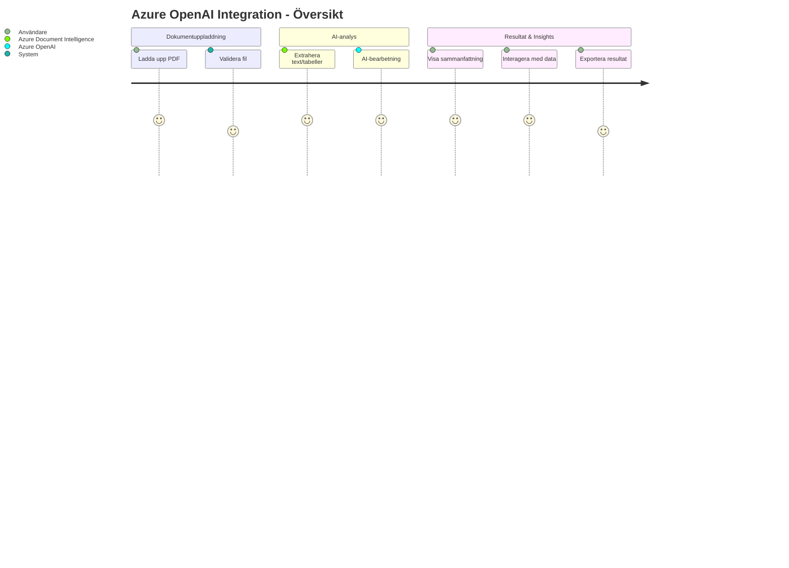
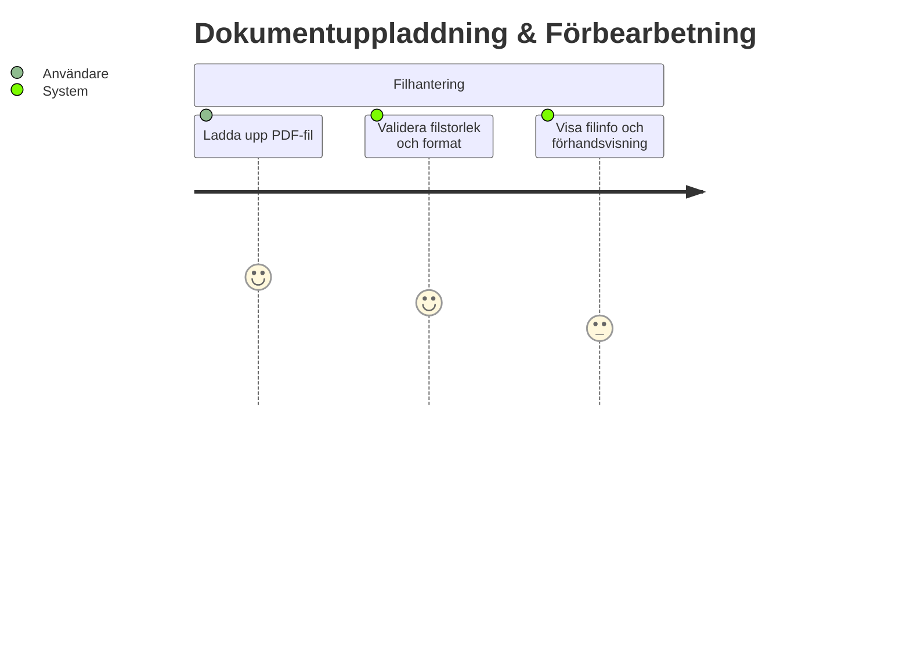
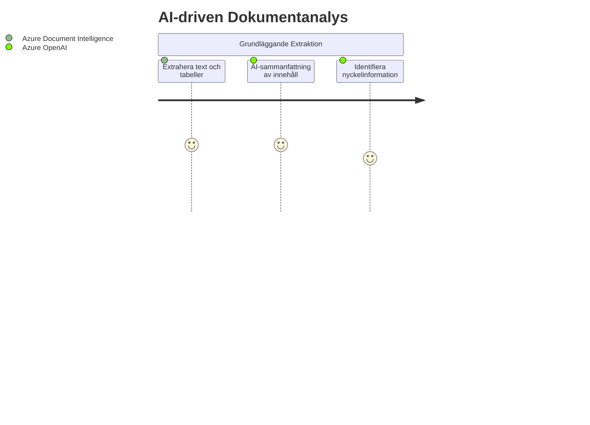
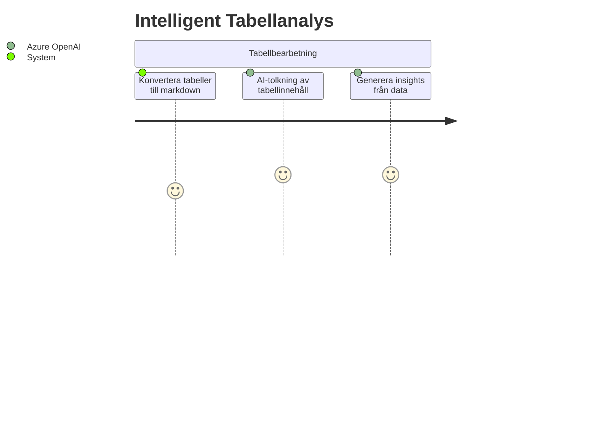
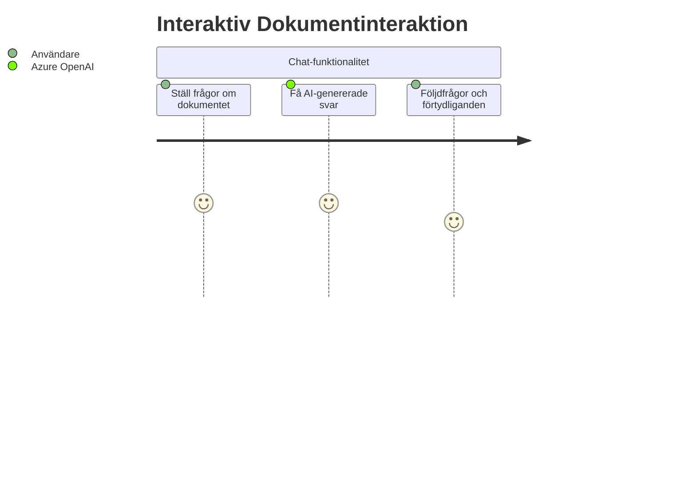
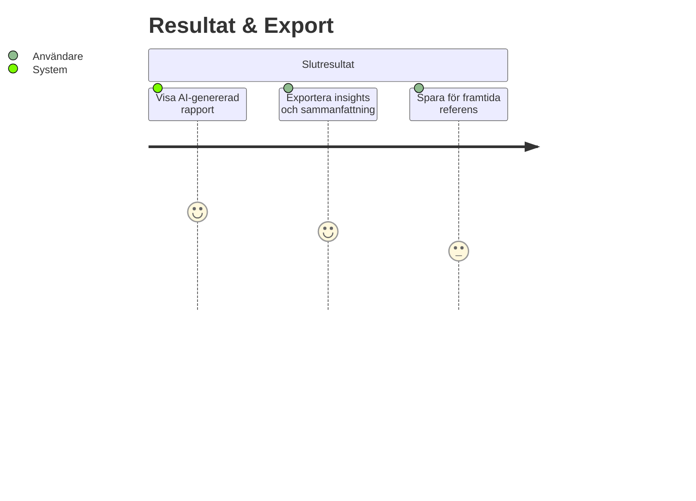

# 🚀 User Journey - Azure OpenAI Integration Release 1

## 📋 Översikt - Hela Resan

---

## 📄 Fas 1: Dokumentuppladdning & Förbearbetning

**Möjligheter med AI:**
- Automatisk dokumentklassificering vid uppladdning
- Intelligenta varningar för komplexa dokument
- Förhandsvisning av förväntat resultat

---

## 🔍 Fas 2: AI-driven Dokumentanalys

**Möjligheter med AI:**
- Automatisk sammanfattning av långa dokument
- Identifiering av viktiga punkter och handlingspunkter
- Kategorisering av innehåll (faktura, rapport, kontrakt, etc.)

---

## 📊 Fas 3: Intelligent Tabellanalys

**Möjligheter med AI:**
- Automatisk förklaring av komplexa tabeller
- Identifiering av trender och mönster i data
- Generering av handlingspunkter baserat på tabellinnehåll

---

## 💬 Fas 4: Interaktiv Dokumentinteraktion

**Möjligheter med AI:**
- Naturlig språkinteraktion med dokumentinnehåll
- Kontextmedvetna svar baserat på hela dokumentet
- Intelligenta förslag för vidare analys

---

## 📈 Fas 5: Resultat & Export

**Möjligheter med AI:**
- Automatisk generering av strukturerade rapporter
- Anpassade export-format baserat på dokumenttyp
- Intelligenta rekommendationer för vidare åtgärder

---

## 🎯 Förväntade Fördelar

### För Användare:
- ⚡ **Snabbare förståelse** av komplexa dokument
- 🎯 **Fokuserad analys** av viktig information
- 💡 **Nya insights** som manuell analys skulle missa
- 🔄 **Interaktiv upptäckt** av dokumentinnehåll

### För Systemet:
- 🤖 **Automatiserad kvalitetskontroll** av extraherad data
- 📊 **Intelligent datastrukturering** för bättre export
- 🎨 **Anpassad presentation** baserat på dokumenttyp
- 🔗 **Kontextmedveten** datahantering

---

## 🚀 Implementeringsprioritet

1. **Fas 1-2**: Grundläggande AI-sammanfattning och dokumentklassificering
2. **Fas 3**: Intelligent tabellanalys och insights
3. **Fas 4**: Chat-funktionalitet för dokumentinteraktion
4. **Fas 5**: Avancerad rapportgenerering och export

Varje fas bygger på den föregående och ger omedelbart värde för användarna! 